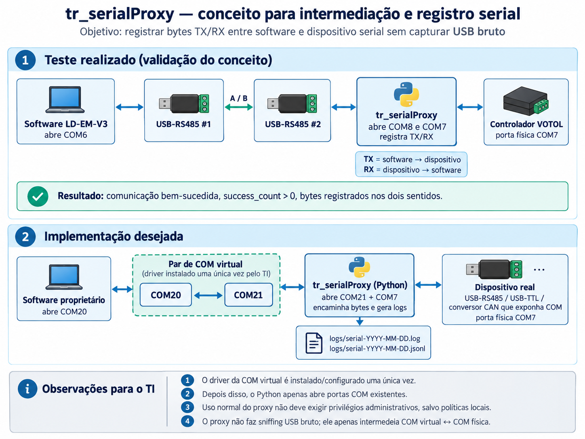

# Validação dos dois arranjos

Os testes relatados confirmaram comunicação bidirecional com o software
operacional, dados atravessando o proxy e registro de TX e RX. Primeiro foi
usada uma ligação física intermediária; depois, um par virtual via com0com.
Não foram medidos aqui limites de desempenho, latência ou perda sob carga.

## Preparação comum

1. Instale o pacote conforme o [README](../README.md) e use o Python da `.venv`.
2. Liste as portas com `python -m tr_serial_proxy --list-ports`.
3. Identifique cada ponta e ajuste baud, paridade, bits de dados e stop bits
   conforme o dispositivo. Cada COM deve ser aberta apenas pelo processo responsável.
4. Inicie o proxy antes da comunicação do software. Use Ctrl+C para encerrar
   e conferir o resumo; os logs permanecem locais.

## Processo 1 — protótipo com conversores físicos

```text
Software ↔ COM6/conversor A ↔ cabo RS485 ↔ conversor B/COM8
                                                      ↕
                                                tr_serialProxy
                                                      ↕
                                            COM7/conversor C ↔ dispositivo
```

1. Dois conversores USB-RS485 foram conectados fisicamente entre si, formando
   a ligação intermediária entre COM6 e COM8. A ligação deve seguir a pinagem
   e os requisitos elétricos dos adaptadores.
2. O software foi configurado para abrir **COM6**.
3. Um terceiro conversor, na **COM7**, foi conectado ao dispositivo real.
4. O proxy abriu **COM8** como lado do software e **COM7** como lado do dispositivo.
   Exemplo de comando, ajustando `9600` ao baud efetivamente utilizado:

   ```powershell
   python -m tr_serial_proxy --physical-port COM7 --virtual-port COM8 --baud 9600 --raw-log
   ```

5. Ao iniciar a comunicação no software, o caminho TX foi COM6 → COM8 → proxy
   → COM7 → dispositivo. A resposta RX percorreu o caminho inverso.
6. O teste foi relatado como bem-sucedido, demonstrando que o proxy recebia,
   registrava e encaminhava bytes nos dois sentidos.

Apesar do nome `--virtual-port`, COM8 era física. O programa abre a porta
informada com pySerial e não exige que essa ponta seja virtual. O proxy não
abre COM6, evitando disputa com o software. São três conversores no total;
COM6 e COM8, sozinhas, não representam a montagem completa.

## Processo 2 — COM virtual com com0com

```text
Software ↔ COM13 ↔ com0com ↔ COM14 ↔ tr_serialProxy ↔ COM física ↔ dispositivo
```

1. O par **COM13 ↔ COM14** foi criado com com0com, seguindo a política de
   instalação de drivers do ambiente. O proxy não instala nem configura o driver.
2. O software foi configurado para abrir **COM13**. A captura fornecida mostra
   essa seleção e **9600 baud**.
3. O proxy abriu **COM14** e a COM física do dispositivo, conforme o relato do
   teste. A captura não mostra o comando de inicialização nem comprova o número
   dessa COM física; por isso, o exemplo usa um marcador a substituir:

   ```powershell
   python -m tr_serial_proxy --physical-port COMX --virtual-port COM14 --baud 9600 --raw-log
   ```

4. Substitua COMX pela COM real antes de executar. O software continua usando
   COM13, sem precisar conhecer a porta física do dispositivo.
5. A comunicação permaneceu operacional. A captura mostra dados na interface
   do software e registros TX/RX no terminal; o relato confirma o encaminhamento
   bidirecional pela ponte virtual. A opção `--raw-log` do exemplo permite
   registrar JSONL, mas a captura não comprova que ela foi usada naquele teste.
6. O par virtual substituiu os dois conversores intermediários do protótipo,
   preservando o adaptador conectado ao dispositivo.

COM13/COM14 são os números usados na validação, não requisitos fixos.
Consulte a [configuração da COM virtual](virtual-com-setup.md).

## Imagens analisadas



*Diagrama fornecido para ilustrar o protótipo e a evolução para COM virtual.*

O diagrama foi preservado sem alterações. Para lê-lo no contexto atual:

- “Implementação desejada” já foi validada posteriormente com com0com.
- COM20/COM21 na ilustração são exemplos anteriores; o teste virtual usou COM13/COM14.
- A indicação `success_count > 0` pertence ao material ilustrativo; o proxy atual
  não possui esse contador. Ele conta blocos e bytes TX/RX, sem confirmar entrega.
- Os nomes de log no desenho estão abreviados: os arquivos atuais incluem hora
  e microssegundos, além da data.
- Os nomes de produto na imagem identificam o exemplo fornecido, sem indicar
  interpretação de protocolo ou garantia de compatibilidade pelo projeto.

A captura de tela também foi analisada, mas ficou fora da documentação pública
por conter telemetria, identificação de hardware e bytes reais de comunicação.
Ela foi preservada localmente e excluída pelo `.gitignore`. Nenhum payload dessa
captura foi transcrito nesta documentação.

## Fragmentação observada

A captura mostra blocos RX sucessivos de **1, 1, 1 e 14 bytes**. Isso é compatível
com buffering e leitura normal de uma sequência serial. Os limites de `read()`
não identificam limites de mensagens, inserção de dados pelo com0com ou quebras
de linha. Tampouco demonstram como o emissor dividiu suas escritas.

O comportamento permanece: registrar cada bloco recebido e encaminhar os mesmos
bytes, sem reconstruir frames ou interpretar protocolo. Veja a
[explicação na arquitetura](architecture.md#fragmentação-normal-de-leitura).

## Alcance do resultado

O teste valida os arranjos descritos, sem afirmar ausência de latência, suporte
a todo dispositivo ou ausência de perda em qualquer condição. O escopo continua
restrito a interfaces COM: não inclui HID direto, USB bruto ou CAN sem COM.
Os [limites operacionais](limitations.md) continuam aplicáveis.
